### Криптографічний захист клієнт-серверної взаємодії в СКБД PostgreSQL

1. Встановити OpenSSL-пакет. В терміналі командного рядку запустити утиліту openssl та переглянути перелік доступних команд.
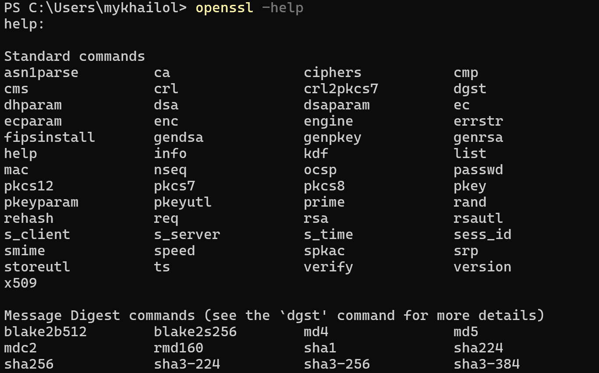

2. Створити самопідписаний сертифікат для сервера СКБД PostgreSQL з наступними параметрами:  − атрибути C=UA, L=Odessa, O=OPU, OU=group, CN=surname.op.edu.ua, де group – назва вашої групи латиницею, surname – ваше прізвище латиницею − строк дії сертифікату = (variant * 10) днів, де variant – значення вашого варіанту.
   `openssl req -new -x509 -days 130 -nodes -text -out server.crt -keyout server.key -subj "/C=UA/L=Odesa/O=OPU/OU=AI-202/CN=larin.op.edu.ua"`
3. 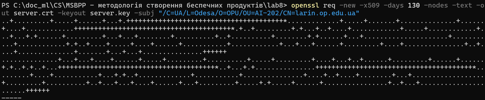   

3. Переглянути вміст сертифікату та визначити алгоритми створення відкритого ключа, а також алгоритм встановлення цифрового підпису.
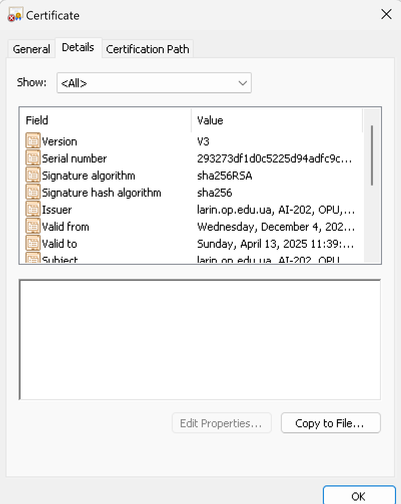
4. Скопіювати створений сертифікат відкритого ключа та закритий ключ до каталогу сервера СКБД PostgreSQL, яка використовувалася у попередній лабораторній роботі. Уконфігураційному файлі postgresql.conf налаштувати значення SSL-параметрів для підтримки SSL-з'єднання між сервером та клієнтами.
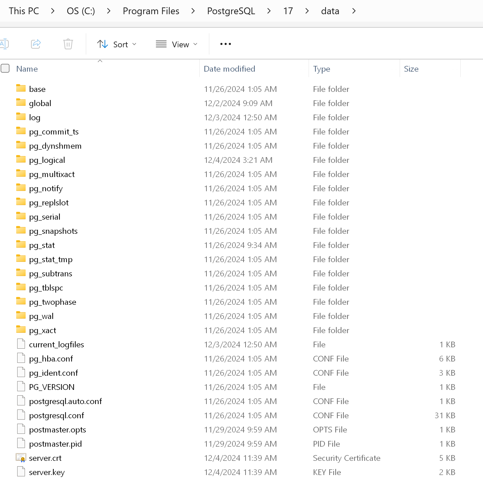

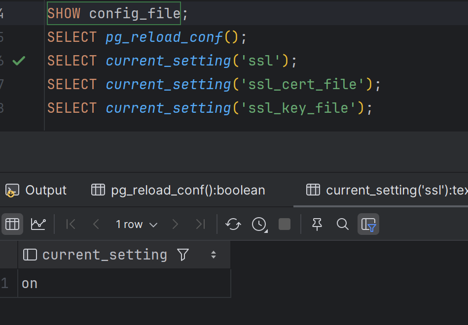

5. Використовуючи програму psql, встановити TSL/SSL-з'єднання з БД за прикладом з попередньої лабораторної роботи, але використовуючи формат параметрів "host=var1 port=var2 dbname=var3 user=var4 password=var5 sslmode=var6". Визначити версію TSL-протоколу та перелік використаних криптоалгоритмів.
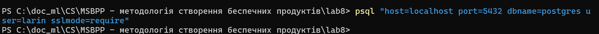
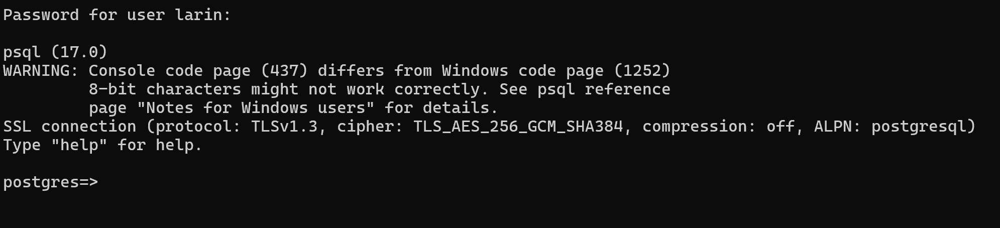

6. Встановити ПЗ контейнерної віртуалізації Docker та запустити Docker через ваш Docker-обліковий запис.
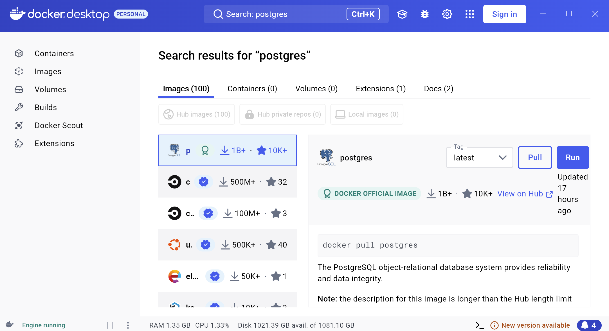

7. Запустити Docker-контейнер СКБД PostgreSQL, використовуючи раніше розглянуті приклади (порт прослуховування запитів СКБД PostgreSQL = 5446).

`docker run --name larin-postgres -p 5446:5432 -e POSTGRES_PASSWORD=larin -d --rm postgres`

8. У Docker-контейнері встановити програмний пакунок аналізу мережевих пакетів tcpdump. Отримати перелік мережевих інтерфейсів на вашому комп’ютері.
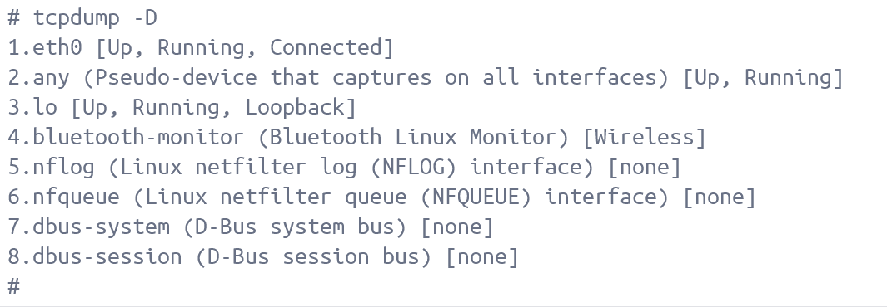

9. Провести запуск програми аналізу мережевих пакетів для кожного мережевого інтерфейсу поки не буде знайдено активний інтерфейс, який взаємодіє з мережею Internet та виводить на екран інформацію про ці пакети.

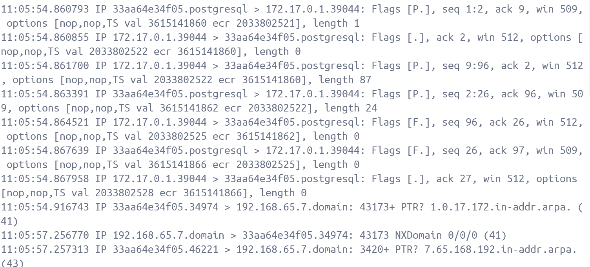

10. Запустити програму аналізу мережевих пакетів в режимі прослуховування обраного мережевого інтерфейсу та налаштувати її на перегляд пакетів, які пов'язані з портом 5432, зберігаючи зміст пакетів в окремому файлі через перенаправлення потоку, наприклад, > res.dump. Результати роботи будуть використанні у наступних завданнях.
    `tcpdump -i 1 port 5432 -X > res1.dump`
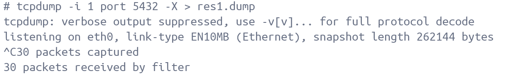

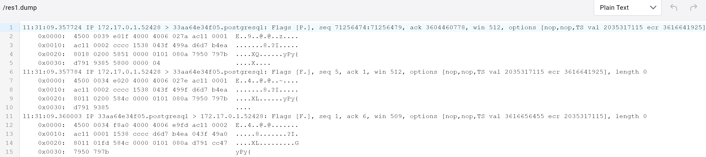

11. Запустити окрему термінальну консоль та становити зв'язок із СКБД PostgreSQL, яка запущена через Docker-контейнер. Після успішного встановлення визначити версію TSL-протоколу та перелік використаних криптографічних алгоритмів.

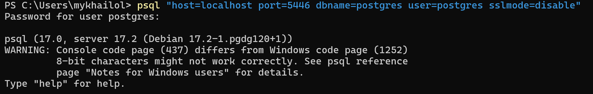

12. Виконати команду створення користувача за прикладом з лабораторної роботи No6.

`CREATE USER larin WITH PASSWORD 'larin';
`

13. Проаналізувати вміст перехоплених пакетів, які було збережено у файлі, наприклад, res.dump. Підтвердити передачу деяких даних у відкритому вигляді.

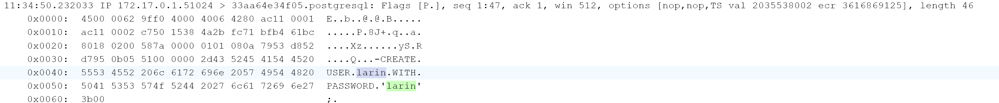

14. Повторити пункт 11, встановивши зв’язок із СКБД, але вже через TLS/SSL-з’єднання.

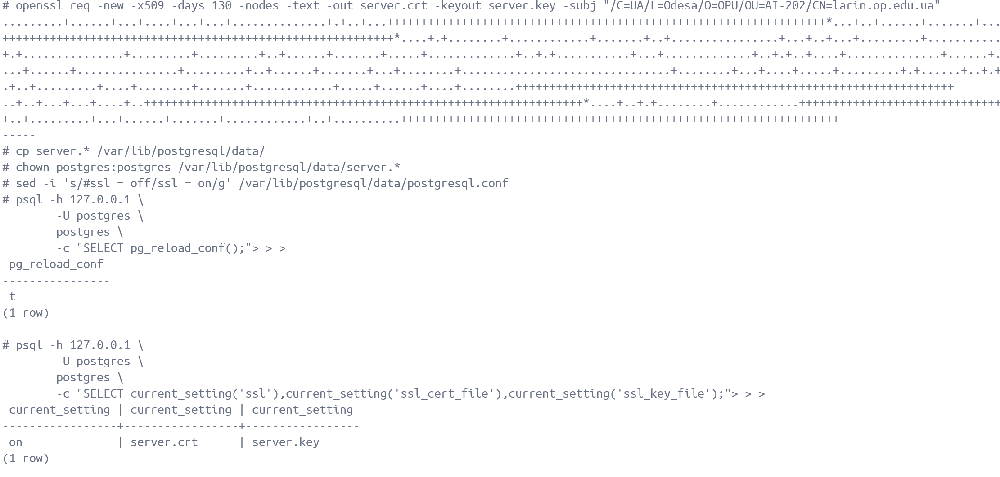

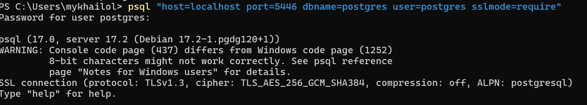

15. Проаналізувати вміст перехоплених пакетів в програмі-аналізаторі. Підтвердити відсутність даних у відкритому вигляді.

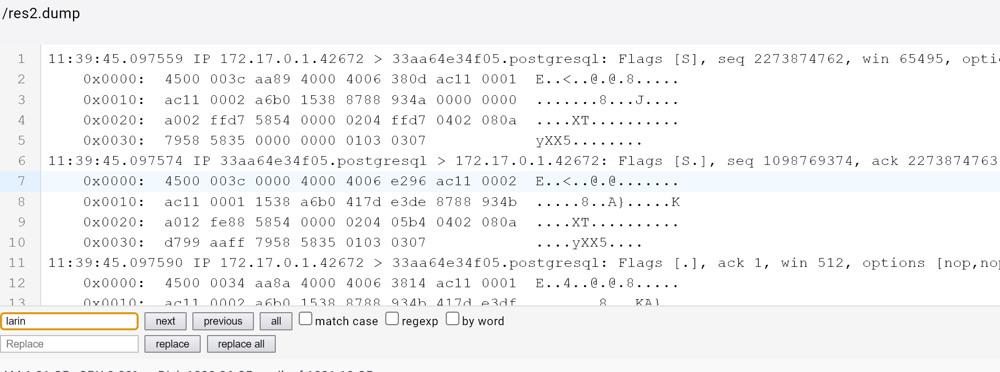
